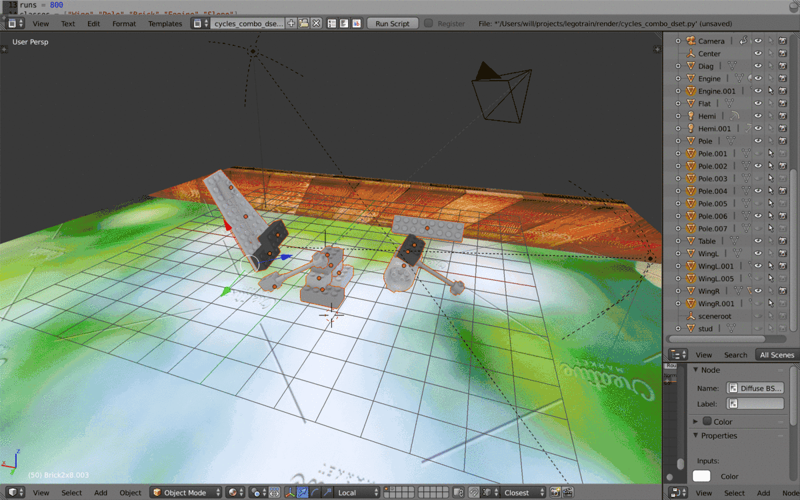
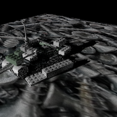
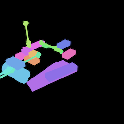
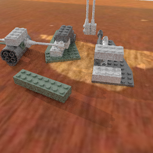
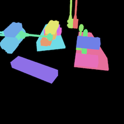
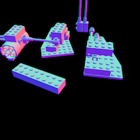
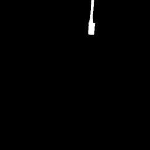

# LegoImageRenderer for Blender 2.79

A set of Python scripts/Blender utilities for rendering Lego scenes for use in training deep learning algorithms.
Includes a basic scene with a tracked camera, scripts for rendering images, normals, masks of Lego combinations, and utilities for recording the positions of special features on different pieces (studs, corners, holes) easily.

      

      

## Folders and Files:

* render
  * renderbench.blend: blend file containing a camera view-locked to the center of the scene and a surface with an adjustable image texture

  * scripts for rendering datasets of single pieces/combinations or single images, the combination script works by taking all selected pieces in the scene and randomly setting their material values 

* utils
  * record_studs.py: when you'd like to record the locations of studs or other meaningful features on each piece, select them (vertices) in edit mode and run this script

* dataprep
  * seperate_masks.py: functions for separating the rendered masks by hue according to the json file generated during rendering
  * cycles_dataprep.py: functions for gathering renders and separated masks into a COCO dataset

* fileconversion
  * scripts for unzipping and converting files downloaded from printabrick or other random sources

* piecedata
  * folder containing coordinates of meaningful features in json files

This project should be useful to people interested in generating high quality training data of Lego pieces.  I think Lego will play a very important role in the development of artificial intelligence over the next 10 years.  The need for both fuzzy logic (visual pattern recognition, loose but modular understanding of 3D shape) and structured reasoning (how pieces can be voxelized and fit together logically despite occlusion and subtle structural differences) is something current deep learning approaches struggle with.  Once these dynamics can be reliably predicted, solutions to robotics problems involving subtle movement (fitting pieces together for example) could be explored.

I used these scripts in my <a href="https://github.com/WHSnyder/Brickthrough"> Lego DL project </a> and I hope to save people the week or so required to learn Blender Python API quirks. 

## Note: If importing pieces from Leocad/LDRAW scale them down by .016

## To Do:

* The rendering scripts still render the normals and mask passes with the cycles rendering engine.  This is probably very wasteful since no interesting shading calculations are needed but I don't know how to bypass the raytracing infrastructure via script in Python.

* Blender 2.8 support

* Add menus/widgets as part of an actual addon